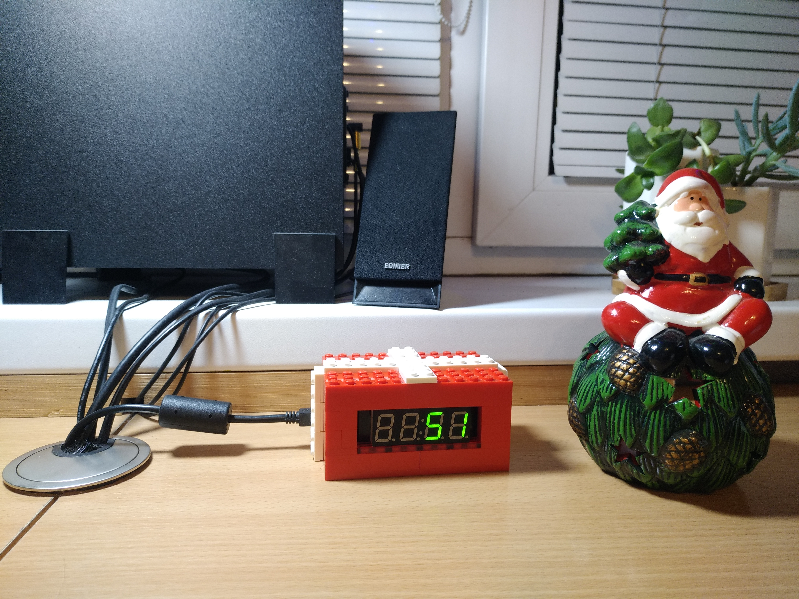

# Unread Gmail Messages Counter

This is a extra branch with another usage of original project. It's counting unread messages in your gmail account and prints it to the 4-digits 7-segment display. It is working on *Linux* and *Windows*.

> It is using *active* listenning. This means, that it sleep for some *timeout* and then asks Google API for messages. This was done cause of simplicity, because in another way there should be a *server* for Google Webhooks.

By using this code you can create your own device, that will display anything you need, so feel free to try it.

## Hardware

As a hardware I am using *Arduino Nano* and *TM1637* green display.

## Linux

### Usage

If you want to run it manually then you can run it like this:

```bash
python3 src/Counter.py
```

You can also specify:

* port device connected to by using `-p` flag. Default is: `/dev/tty/USB0`
* path to credentials.json file. Default is: `credentials.json`
* timeout to sleep by using `-t` flag. Default is: `300` seconds;

Example:

```bash
python3 src/Counter.py -f ~/credentials.json -p /dev/ttyUSB1 -t 600
```

If you want to run it as a daemon service (see below) but with custom flag options then change `ExecStart` item in the [trash-items-counter.service](Linux/trash-items-counter.service)

### Installing

Run the next commands:

```bash
cd Linux
sudo pip3 install --upgrade pyserial google-api-python-client google-auth-httplib2 google-auth-oauthlib
chmod +x install.sh
sudo ./install.sh
```

Put file named `credentials.json` in the */etc/* directory. This is your own file from Google API, get it there: [https://console.developers.google.com/apis/credentials](https://console.developers.google.com/apis/credentials)

### Running

#### First time

In the first time you have to run in like that:

```bash
pyhton3 src/Counter.py -f /etc/credentials.json
```

This will promote you to give some permissons and creates a new file names token.pickle. It's a file used in Google API. Move it to the */etc/* directory.

Mooving to the */etc/* directory is needed for daemon running.

#### Not first time

To enable running scipt on startup run the following:

```bash
sudo systemctl enable trash-items-counter.service
```

If you want to start it only now run this instead:

```bash
sudo systemctl start trash-items-counter.service
```

### Stopping

```bash
sudo systemctl stop trash-items-counter.service
```

## Windows

### Usage

You can specify a port device connected to using `-p` flag (see your port in *Device Manager*). By default *COM3* is using.

You can specify a directory to observe using `-d` flag. By default *Trash* directory is using.

> To pass flag option in startup script you should insert it to the [Counter.bat](Windows/Counter.bat) file.

Example: `wscript.exe "InvisibleCounter.vbs" "Counter.exe" -p COM5 -d D:Movies`

### Installing

To run program on startup follow the next steps:

1. Create a shorcut for *[Counter.bat](Windows/Counter.bat)*
2. Hit *Win+R* and type *shell:startup*
3. Copy shortcut to the openned Strartup folder

## Lego

Use [instruction](Lego/instruction.html) to build your Lego corpus.

## Image


